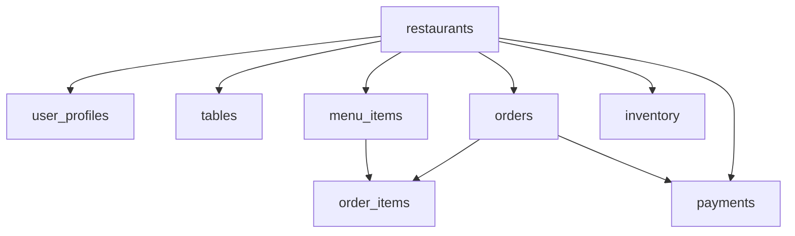

# Restaurant POS System 🍽️

A comprehensive, production-ready Restaurant Point of Sale (POS) system built as a multi-tenant SaaS platform. Features real-time order management, inventory tracking, payment processing, and advanced analytics.

## 🌟 Features

### 🔐 Multi-Tenant Architecture
- Role-based access control (Owner, Manager, Cashier, Waiter)
- Restaurant-level data isolation
- Scalable SaaS architecture

### 📱 Modern POS Interface
- Intuitive touch-friendly interface
- Real-time order tracking
- Table management system
- Offline-first capabilities with sync

### 💳 Payment Processing
- Integrated Razorpay payment gateway
- Support for cash, card, and UPI payments
- Secure payment processing via edge functions
- Automatic receipt generation

### 📊 Analytics & Reporting
- Real-time dashboard with key metrics
- Revenue trends and growth analysis
- Top-selling items tracking
- Hourly and daily sales reports
- Interactive charts with Recharts

### 🗂️ Inventory Management
- Stock level tracking
- Low-stock alerts
- Supplier management
- Automated inventory adjustments
- Cost tracking and valuation

### 🎨 Beautiful UI/UX
- Modern glass-morphism design
- Smooth animations with Framer Motion
- Responsive design for all devices
- Professional color scheme
- Accessibility compliant

## 🛠️ Tech Stack

### Frontend
- **Next.js 13+** - React framework with App Router
- **TypeScript** - Type-safe development
- **Tailwind CSS** - Utility-first styling
- **shadcn/ui** - Modern component library
- **Framer Motion** - Smooth animations
- **Recharts** - Interactive charts

### Backend
- **Supabase** - Backend-as-a-Service
  - PostgreSQL database
  - Authentication & authorization
  - Real-time subscriptions
  - Row Level Security (RLS)
  - Edge functions
  - File storage

### Payments
- **Razorpay** - Payment processing
- **Secure Edge Functions** - Payment handling

### Testing
- **Jest** - Unit and integration testing
- **Playwright** - End-to-end testing
- **Testing Library** - Component testing

### Deployment
- **Vercel** - Frontend hosting
- **Supabase** - Backend infrastructure

## 🚀 Quick Start

### Prerequisites
- Node.js 18+
- npm or yarn
- Supabase account
- Razorpay account (for payments)

### Installation

1. **Clone the repository**
   ```bash
   git clone <repository-url>
   cd restaurant-pos-system
   ```

2. **Install dependencies**
   ```bash
   npm install
   ```

3. **Set up environment variables**
   ```bash
   cp .env.example .env.local
   ```
   
   Fill in your Supabase and Razorpay credentials:
   ```env
   NEXT_PUBLIC_SUPABASE_URL=your_supabase_url
   NEXT_PUBLIC_SUPABASE_ANON_KEY=your_supabase_anon_key
   NEXT_PUBLIC_RAZORPAY_KEY_ID=your_razorpay_key_id
   ```

4. **Set up Supabase**
   - Create a new Supabase project
   - Run the migration files in the SQL editor
   - Configure authentication settings
   - Set up storage buckets

5. **Deploy Edge Functions**
   ```bash
   npm install -g supabase
   supabase login
   supabase link --project-ref your_project_ref
   supabase functions deploy create-payment
   ```

6. **Start development server**
   ```bash
   npm run dev
   ```

7. **Open your browser**
   Navigate to `http://localhost:3000`

## 🧪 Testing

### Unit & Integration Tests
```bash
npm run test
npm run test:watch
npm run test:coverage
```

### End-to-End Tests
```bash
npm run test:e2e
npm run test:e2e:ui
```

### Test Coverage
- Authentication flows
- Order management
- Payment processing
- Inventory tracking
- Real-time features
- Offline functionality

## 📱 Demo Accounts

Use these credentials to explore different user roles:

| Role | Email | Password |
|------|--------|----------|
| Owner | owner@demo.com | password123 |
| Manager | manager@demo.com | password123 |
| Cashier | cashier@demo.com | password123 |
| Waiter | waiter@demo.com | password123 |

## 🏗️ Architecture

### Database Schema


### Authentication & Authorization
- **Row Level Security (RLS)** ensures data isolation
- **Role-based permissions** control feature access
- **JWT tokens** for secure API communication

### Real-time Features
- **Supabase Realtime** for live order updates
- **WebSocket connections** for instant notifications
- **Optimistic updates** for better UX

### Offline Support
- **Service Worker** for caching
- **IndexedDB/LocalStorage** for offline data
- **Automatic sync** when connection restored

## 📊 Key Features Deep Dive

### POS System
- **Menu browsing** with categories and search
- **Cart management** with quantity controls
- **Table selection** and customer info
- **Multiple payment methods**
- **Order status tracking**

### Dashboard Analytics
- **Revenue metrics** (today, week, month)
- **Order statistics** with completion rates
- **Top-selling items** analysis
- **Hourly sales patterns**
- **Growth rate calculations**

### Inventory Management
- **Stock level monitoring**
- **Automatic alerts** for low stock
- **Supplier information** tracking
- **Cost analysis** and valuation
- **Restock management**

### Reports & Analytics
- **Interactive charts** for data visualization
- **Date range filtering**
- **Export capabilities**
- **Performance metrics**
- **Trend analysis**

## 🔒 Security

### Data Protection
- **Row Level Security (RLS)** on all tables
- **API key protection** in edge functions
- **Input validation** and sanitization
- **SQL injection prevention**

### Payment Security
- **PCI DSS compliant** payment processing
- **No sensitive data storage**
- **Encrypted communications**
- **Webhook verification**

### Authentication
- **Secure password hashing**
- **JWT token management**
- **Session handling**
- **Role-based access control**

## 🚀 Deployment

See [DEPLOYMENT.md](./DEPLOYMENT.md) for detailed deployment instructions.

### Production Checklist
- [ ] Environment variables configured
- [ ] Database migrations applied
- [ ] RLS policies enabled
- [ ] Edge functions deployed
- [ ] Payment webhooks configured
- [ ] SSL certificates installed
- [ ] Monitoring set up

## 🤝 Contributing

We welcome contributions! Please see our [Contributing Guide](./CONTRIBUTING.md) for details.

### Development Workflow
1. Fork the repository
2. Create a feature branch
3. Make your changes
4. Add tests for new features
5. Ensure all tests pass
6. Submit a pull request

## 📄 License

This project is licensed under the MIT License - see the [LICENSE](./LICENSE) file for details.

## 🆘 Support

- **Documentation**: Check our [docs](./docs) folder
- **Issues**: Create an issue on GitHub
- **Discussions**: Join our community discussions
- **Email**: support@restaurantpos.com

## 🎯 Roadmap

### Upcoming Features
- [ ] Multi-location support
- [ ] Advanced reporting
- [ ] Mobile apps (React Native)
- [ ] Kitchen display system
- [ ] Loyalty program
- [ ] Integration with delivery platforms

### Performance Improvements
- [ ] Query optimization
- [ ] Caching strategies
- [ ] Bundle size reduction
- [ ] PWA enhancements

## 🙏 Acknowledgments

- [Next.js](https://nextjs.org/) - React framework
- [Supabase](https://supabase.com/) - Backend platform
- [Tailwind CSS](https://tailwindcss.com/) - CSS framework
- [shadcn/ui](https://ui.shadcn.com/) - Component library
- [Framer Motion](https://www.framer.com/motion/) - Animation library
- [Recharts](https://recharts.org/) - Chart library

---

**Built with ❤️ for the restaurant industry**

Transform your restaurant operations with our modern, feature-rich POS system. From order management to analytics, we've got everything you need to run a successful restaurant business.